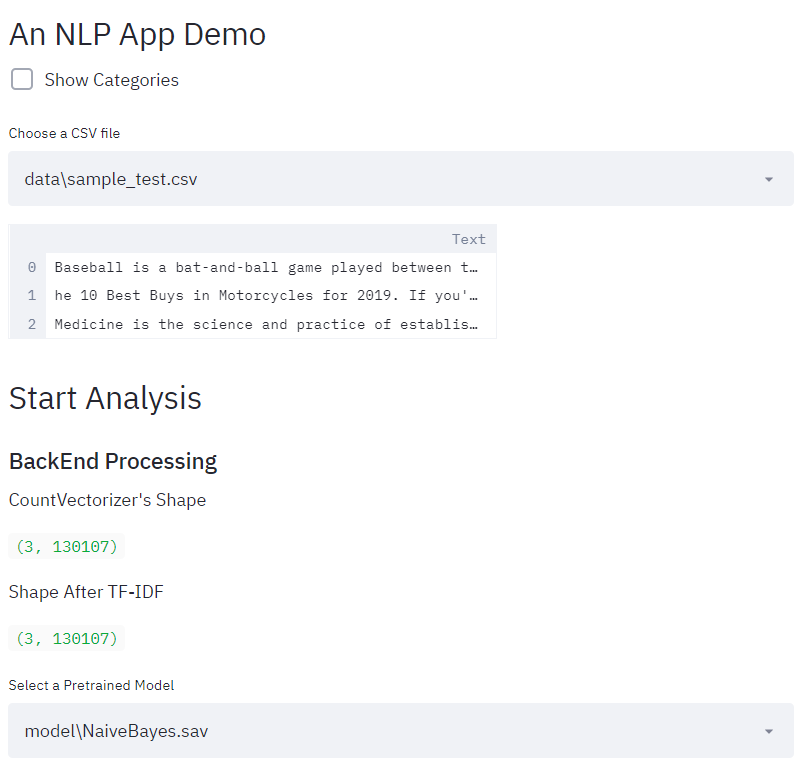

# NLPsklearn
This is an app that is created based on one of the sci-kit learn's tutorials which highlights the training procedure for text data.
https://scikit-learn.org/stable/tutorial/text_analytics/working_with_text_data.html

User Interface of the NLP app



# Installation

This repository is tested on Python 3.7+

Clone the repository

```sh
$ git clone https://github.com/CJtheSloth/NLPsklearn
```

Install the dependencies

```sh
$ pip install pandas streamlit matplotlib scikit-learn joblib
```

Run the application by opening a command prompt with
```sh
$ streamlit run NLP_classifier.py
```

# Python Files
<list>
  <li> NLP_classifier.py : Run this in command prompt to display app on localhost
  <li> ModelExport.py : Run this in command propmpt if you want to quickly train some default models
  <li> LoadandPredict.py: It allows you to test out your own/pre-trained model
</list>

